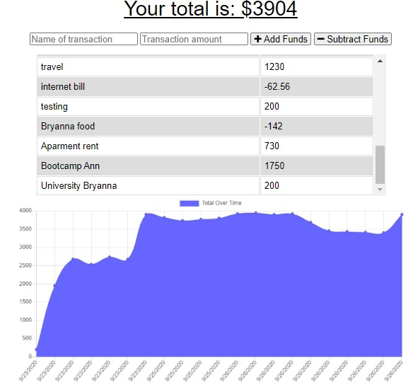

# BUDGET TRACKER

  

# Description

Budget Tracker is an application where the user can add expenses and deposits to their budget online or offline. You can install the application on any device (cell phone, tablet, etc.) for hassle-free use.

 

 ### Visit the site! [Budget Traker](https:)

    
# Usage 
 - The user can make 2 types of transactions, where once added the graph will be updated.
- intallar the app, go to the url of the application and click on the plus sign, a message will be shown (install Budget Traker)

# License
The license for which the application is covered:
NONE 

# Questions

  If you have questions about the project, below you can find ways to answer them, either by visiting my highub or contacting me by email.
  
  Link to my Github: [anniavd](https://github.com/anniavd)

  
  Email acount: [annia.valdesd@gmail.com](mailto:annia.valdesd@gmail.com)
    
